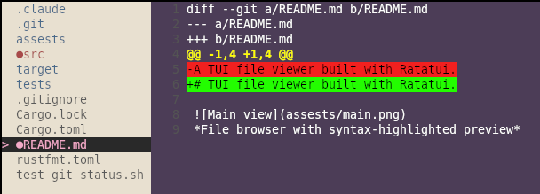

# TUI file viewer built with Ratatui.


*File browser with syntax-highlighted preview*



*Git highlighting with visual diff - modified files marked with ● and colored text*


*Fuzzy search across entire directory tree*


*Text selection in preview pane*

## Build

```bash
cargo build --release
```

## Run

```bash
cargo run [FILE_PATH]
```

## Controls

- `q` or `Esc` - Quit
- `j`/`k` or mouse scroll - Scroll preview
- `PgUp`/`PgDn` - Page up/down in preview
- Click and drag - Select text in preview
- `Ctrl+c` - Copy selected text
- `h`/`l` or `Left`/`Right` - Navigate back/enter directory
- `Shift+H` / `Shift+L` - Shrink/grow file list pane
- `g` - Toggle git highlighting (shows modified files with ● dot indicator and colored text)
- `d` - Toggle unified git diff view for the current file
- `t` - Toggle theme preview (cycle through themes)
- `/` - Open file search (searches entire directory tree from root)
  - Type to filter files by name
  - `Up`/`Down` - Navigate results
  - `Enter` - Go to file and close search
  - `Esc` - Close search
- `f` - Symbol search (tree-sitter powered, supports Rust/Python/JS/TS/Go/HTML/CSS)
  - Type to filter symbols
  - `Up`/`Down` - Navigate results
  - `Enter` - Go to symbol and close search
  - `Esc` - Close search

## Config

Configure in `~/.config/viewer/config.toml`:

```toml
exclude = ["*.pyc", "target/**", "node_modules/**"]
```

## Auto-Refresh

The viewer automatically watches for file changes:

- **Current directory**: Refreshes file list when files are added/deleted
- **Preview file**: Refreshes preview when the viewed file is modified
- **Search index**: Refreshes every 30 seconds to pick up new files
