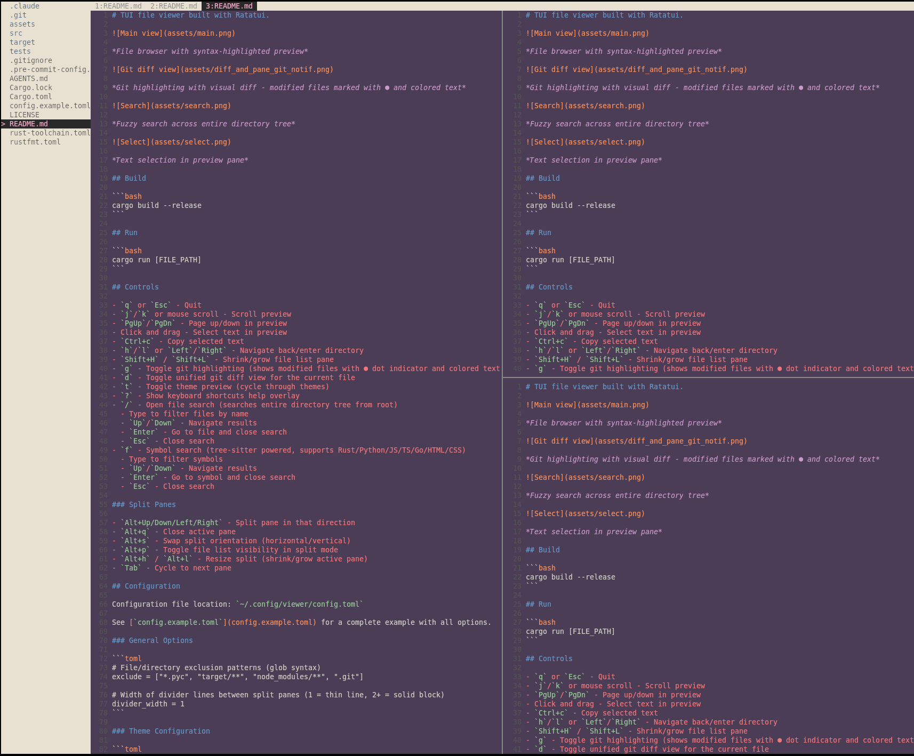

# See: A TUI file viewer.


*File browser with syntax-highlighted preview*


*Git highlighting with visual diff - modified files marked with ● and colored text*


*Fuzzy search across entire directory tree*


*Text selection in preview pane*



*Split panes with tab bar for multiple files*

## Build

```bash
cargo build --release
```

## Run

```bash
cargo run [FILE_PATH]
```

## Controls

Press `?` in the app to see all keyboard shortcuts, or see [`config.example.toml`](config.example.toml) for the full list of configurable key bindings.

## Configuration

Configuration file location: `~/.config/viewer/config.toml`

See [`config.example.toml`](config.example.toml) for all available options including:
- File/directory exclusion patterns
- Theme configuration (Helix themes or custom colors)
- Customizable key bindings

## Auto-Refresh

The viewer automatically watches for file changes:

- **Current directory**: Refreshes file list when files are added/deleted
- **Preview file**: Refreshes preview when the viewed file is modified
- **Search index**: Refreshes every 30 seconds to pick up new files

## Development

### Pre-commit Hooks

Install pre-commit hooks to run formatting and linting checks before each commit:

```bash
pip install pre-commit
pre-commit install
```

This will run `cargo fmt`, `cargo clippy`, and other checks automatically on commit.
